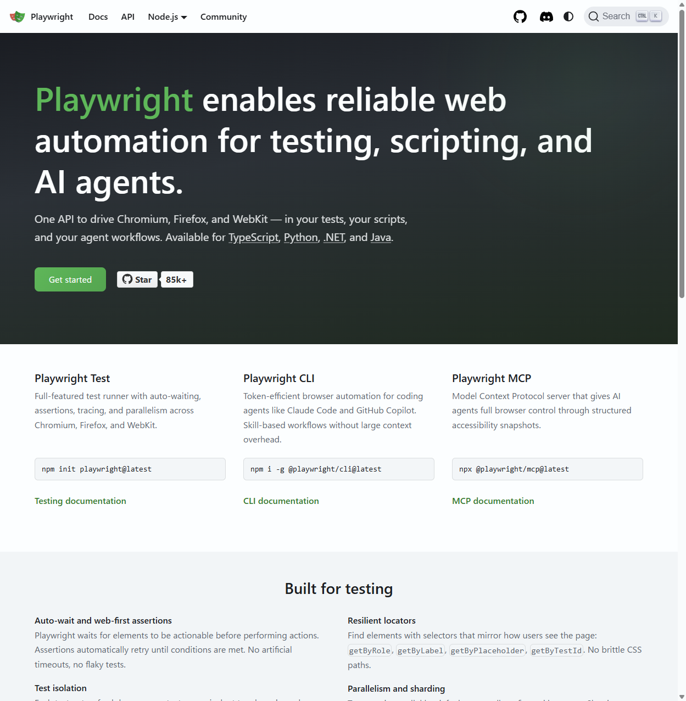

<style>
@import url('https://fonts.googleapis.com/css2?family=Noto+Sans+JP:wght@400;700&family=Fira+Code:wght@400;500;700&display=swap');

:root {
  --color-background: #0d1117;
  --color-foreground: #c9d1d9;
  --color-heading: #58a6ff;
  --color-accent: #7ee787;
  --color-code-bg: #161b22;
  --color-border: #30363d;
  --font-default: 'Noto Sans JP', 'Hiragino Kaku Gothic ProN', 'Meiryo', sans-serif;
  --font-code: 'Fira Code', 'Consolas', 'Monaco', monospace;
}

section {
  background-color: var(--color-background);
  color: var(--color-foreground);
  font-family: var(--font-default);
  font-weight: 400;
  box-sizing: border-box;
  border-left: 4px solid var(--color-accent);
  position: relative;
  line-height: 1.6;
  font-size: 20px;
  padding: 56px;
}

h1, h2, h3, h4, h5, h6 {
  font-weight: 700;
  color: var(--color-heading);
  margin: 0;
  padding: 0;
  font-family: var(--font-code);
}

h1 {
  font-size: 48px;
  line-height: 1.3;
  text-align: left;
}

h1::before {
  content: '# ';
  color: var(--color-accent);
}

h2 {
  font-size: 36px;
  margin-bottom: 36px;
  padding-bottom: 12px;
  border-bottom: 2px solid var(--color-border);
}

h2::before {
  content: '## ';
  color: var(--color-accent);
}

h3 {
  color: var(--color-foreground);
  font-size: 24px;
  margin-top: 28px;
  margin-bottom: 10px;
}

h3::before {
  content: '### ';
  color: var(--color-accent);
}

ul, ol {
  padding-left: 32px;
}

li {
  margin-bottom: 10px;
}

li::marker {
  color: var(--color-accent);
}

pre {
  background-color: var(--color-code-bg);
  border: 1px solid var(--color-border);
  border-radius: 6px;
  padding: 16px;
  overflow-x: auto;
  font-family: var(--font-code);
  font-size: 16px;
  line-height: 1.5;
}

code {
  background-color: var(--color-code-bg);
  color: var(--color-accent);
  padding: 2px 6px;
  border-radius: 3px;
  font-family: var(--font-code);
  font-size: 0.9em;
}

pre code {
  background-color: transparent;
  padding: 0;
  color: var(--color-foreground);
}

footer {
  font-size: 14px;
  color: #8b949e;
  font-family: var(--font-code);
  position: absolute;
  left: 56px;
  right: 56px;
  bottom: 40px;
  text-align: right;
}

footer::before {
  content: '// ';
  color: var(--color-accent);
}

section.lead {
  border-left: 4px solid var(--color-accent);
  display: flex;
  flex-direction: column;
  justify-content: center;
}

section.lead h1 {
  margin-bottom: 24px;
}

section.lead p {
  font-size: 22px;
  color: var(--color-foreground);
  font-family: var(--font-code);
}

strong {
  color: var(--color-accent);
  font-weight: 700;
}
</style>

<!-- _class: lead -->
<!-- _paginate: false -->

# Playwrightと生成AIで
# ブラウザ操作をしてみる

Lightning Talk

---

## アジェンダ

- Playwrightとは
- インストール方法
- WSL + Windows Chrome 連携
- ブラウザでできること

---

## Playwrightとは

- Microsoftが開発するブラウザ自動化ライブラリ
- **Chrome / Firefox / Safari** をサポート
- ヘッドレス・ヘッド付き両モードで動作
- 生成AIのスキルとして利用可能

---

## インストール

CLIツールをグローバルにインストール

```bash
$ npm i -g @playwright/cli@latest
```

スキルファイルは下記から入手

- https://github.com/microsoft/playwright-cli/tree/main/skills/playwright-cli

---

## WSL + Windows Chrome

下記を `SKILL.md` に追記することで
WSLからWindowsのChromeを操作できる

---

## SKILL.md への追記内容

`"/mnt/c/Program Files/Google/Chrome/Application/chrome.exe"` が存在する場合に
`ask_user` か `askQuestions` などの対話ツールを使ってユーザにWindowsのChromeを使用するか確認し、
Windowsでの起動を求められた場合は下記を実施

```bash
"/mnt/c/Program Files/Google/Chrome/Application/chrome.exe" \
  --remote-debugging-port=9222 \
  --user-data-dir='C:\tmp\pw-chrome-debug' \
  --no-first-run https://www.google.com
```

```bash
playwright-cli attach --cdp=http://localhost:9222
```

終了する際はブラウザをクローズしてよいか `ask_user` か `askQuestions` で確認

---

## ブラウザでできること

- **Webページの操作** — クリック・入力・スクロール
- **スクリーンショット取得** — 画面キャプチャ
- **テスト自動化** — E2Eテストの実行
- **データ収集** — ページ情報のスクレイピング
- **生成AIとの連携** — 指示→操作を自動化

---

## 実演① スクリーンショット



実際に取得したスクリーンショット

```bash
playwright-cli goto https://playwright.dev
playwright-cli screenshot \
  --filename=top.png
```

---

## 実演② データ取得

playwright.dev から取得した `h1` テキスト：

> Playwright enables reliable web automation for testing, scripting, and AI agents.

```bash
playwright-cli eval \
  "document.querySelector('h1').textContent"
```

---

## 実演③ API一覧取得

Page クラスのメソッド名を一括取得：

```
addInitScript, addLocatorHandler,
addScriptTag, addStyleTag,
ariaSnapshot, bringToFront,
cancelPickLocator, clearConsoleMessages,
clearPageErrors, close ...
```

```bash
playwright-cli eval \
  "Array.from(document.querySelectorAll('h3.anchor'))
   .map(h => h.textContent).join(', ')"
```

---

## 実演④ 開発者ツール

コンソール・ネットワーク・トレースを取得できる

```bash
# コンソールログを確認
playwright-cli console

# ネットワークリクエスト一覧
playwright-cli network
```

実際に playwright.dev で取得したネットワークログ：

```
[GET] https://playwright.dev/assets/js/17896441.14782575.js
[GET] https://playwright.dev/assets/js/4cf51b27.9f497a86.js
[GET] https://playwright.dev/assets/js/e0719818.d9b9b916.js
...
```

---

## 実演⑤ トレース記録

操作を記録して後からデバッグできる

```bash
playwright-cli tracing-start
playwright-cli click e24        # 操作を記録
playwright-cli tracing-stop     # .trace ファイルに保存
```

保存されたトレース：

```
.playwright-cli/traces/trace-xxx.trace
.playwright-cli/traces/trace-xxx.network
```

> Trace Viewer で再生・ネットワーク・スクリーンショットを確認可能

---

## E2Eテストの作り方

playwright-cli の操作から **テストコードを自動生成**

### ワークフロー

1. `playwright-cli open` でブラウザを開く
2. 操作すると自動でコードが出力される
3. 出力コードをテストファイルにまとめる
4. `npx playwright test` で実行

---

## コード自動生成の例

操作するだけでコードが生成される！

```bash
playwright-cli goto https://playwright.dev
# => await page.goto('https://playwright.dev');

playwright-cli click e24  # Searchボタン
# => await page.getByRole('button',
#      { name: 'Search (Ctrl+K)' }).click();
```

テストファイルに組み込む：

```typescript
import { test, expect } from '@playwright/test';

test('playwright.dev 検索', async ({ page }) => {
  await page.goto('https://playwright.dev');
  await page.getByRole('button',
    { name: 'Search (Ctrl+K)' }).click();
  await expect(page.getByRole('searchbox'))
    .toBeVisible();
});
```

---

<!-- _class: lead -->
<!-- _paginate: false -->

# まとめ

**Playwright + 生成AI** で
ブラウザ操作をもっと手軽に 🚀
