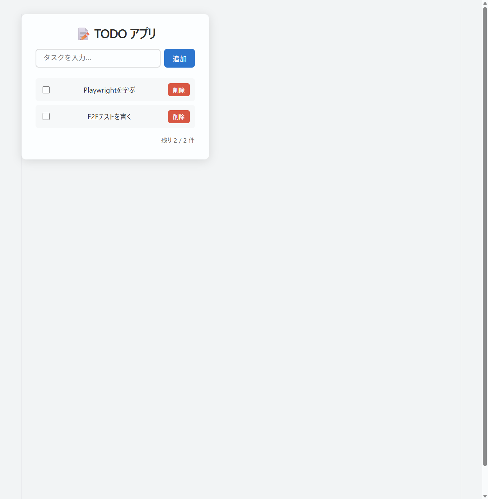
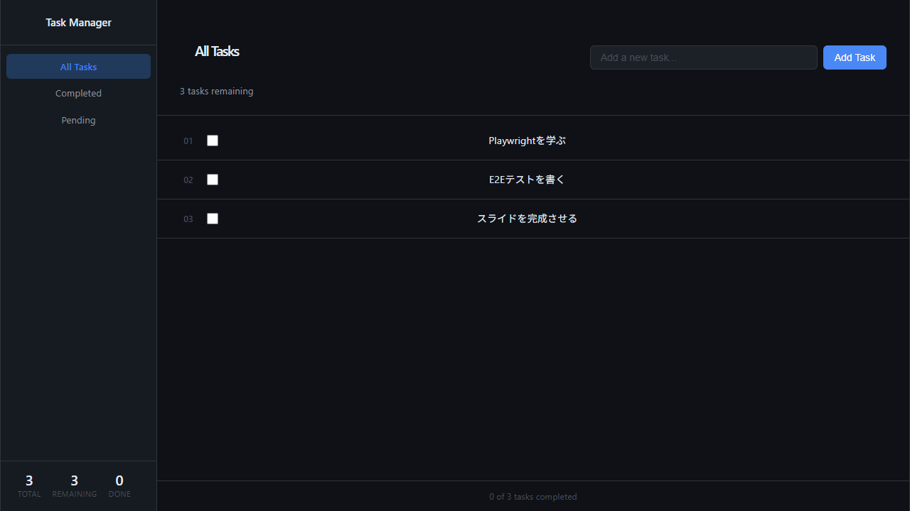
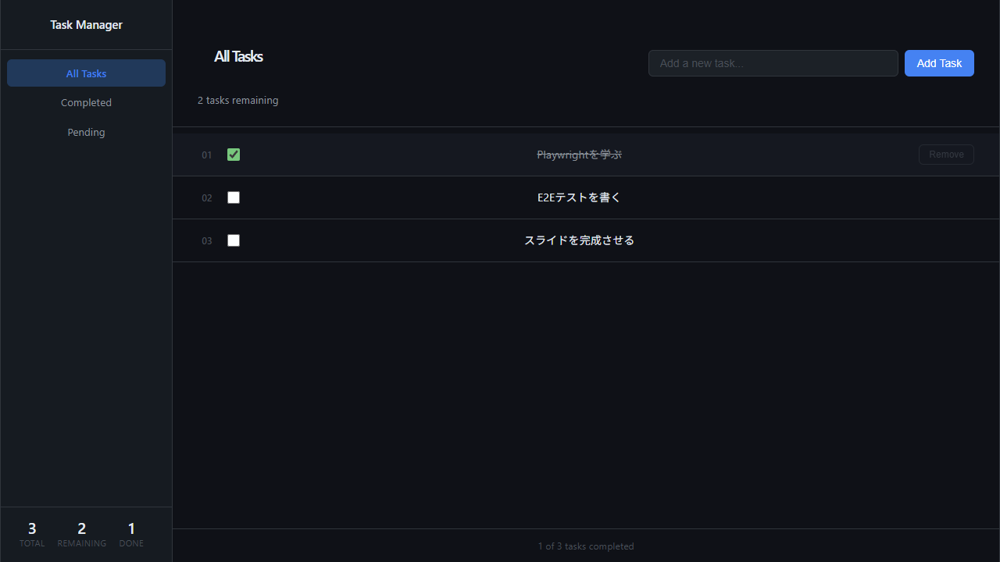

<style>
@import url('https://fonts.googleapis.com/css2?family=Noto+Sans+JP:wght@400;500;700&family=Fira+Code:wght@400;500&display=swap');

:root {
  --color-background: #ffffff;
  --color-foreground: #1f2937;
  --color-heading: #1e40af;
  --color-accent: #3b82f6;
  --color-code-bg: #f0f4f8;
  --color-border: #d1d5db;
  --font-default: 'Noto Sans JP', 'Hiragino Kaku Gothic ProN', 'Meiryo', sans-serif;
  --font-code: 'Fira Code', 'Consolas', 'Monaco', monospace;
}

section {
  background-color: var(--color-background);
  color: var(--color-foreground);
  font-family: var(--font-default);
  font-weight: 400;
  box-sizing: border-box;
  border-top: 6px solid var(--color-heading);
  position: relative;
  line-height: 1.6;
  font-size: 20px;
  padding: 52px 56px 48px;
}

h1, h2, h3, h4, h5, h6 {
  font-weight: 700;
  color: var(--color-heading);
  margin: 0;
  padding: 0;
}

h1 {
  font-size: 48px;
  line-height: 1.3;
}

h2 {
  position: absolute;
  top: 36px;
  left: 56px;
  right: 56px;
  font-size: 30px;
  padding-bottom: 12px;
  border-bottom: 3px solid var(--color-accent);
}

h2 + * {
  margin-top: 96px;
}

h3 {
  color: var(--color-accent);
  font-size: 22px;
  margin-top: 24px;
  margin-bottom: 8px;
  font-weight: 600;
}

ul, ol {
  padding-left: 28px;
}

li {
  margin-bottom: 10px;
  line-height: 1.6;
}

li::marker {
  color: var(--color-accent);
}

pre {
  background-color: var(--color-code-bg);
  border: 1px solid var(--color-border);
  border-radius: 6px;
  padding: 14px 16px;
  overflow-x: auto;
  font-family: var(--font-code);
  font-size: 14px;
  line-height: 1.5;
}

code {
  background-color: var(--color-code-bg);
  color: var(--color-heading);
  padding: 2px 6px;
  border-radius: 3px;
  font-family: var(--font-code);
  font-size: 0.88em;
  border: 1px solid var(--color-border);
}

pre code {
  background-color: transparent;
  border: none;
  padding: 0;
  color: var(--color-foreground);
}

footer {
  font-size: 13px;
  color: #6b7280;
  position: absolute;
  left: 56px;
  right: 56px;
  bottom: 36px;
  text-align: right;
}

section.lead {
  border-top: 6px solid var(--color-heading);
  background: linear-gradient(135deg, #ffffff 0%, #eff6ff 100%);
  display: flex;
  flex-direction: column;
  justify-content: center;
}

section.lead h1 {
  margin-bottom: 24px;
}

section.lead p {
  font-size: 22px;
  color: #4b5563;
}

strong {
  color: var(--color-heading);
  font-weight: 700;
}

blockquote {
  border-left: 4px solid var(--color-accent);
  padding-left: 16px;
  color: #4b5563;
  margin: 16px 0;
  font-size: 18px;
}
</style>

<!-- _class: lead -->
<!-- _paginate: false -->

# Playwrightと生成AIで
# ブラウザ操作をしてみる

Lightning Talk

---

## アジェンダ

- Playwrightとは
- インストール方法
- WSL + Windows Chrome 連携
- ブラウザでできること

---

## Playwrightとは

- Microsoftが開発するブラウザ自動化ライブラリ
- **Chrome / Firefox / Safari** をサポート
- ヘッドレス・ヘッド付き両モードで動作
- 生成AIのスキルとして利用可能

---

## インストール

CLIツールをグローバルにインストール

```bash
$ npm i -g @playwright/cli@latest
```

スキルファイルは下記から入手

- https://github.com/microsoft/playwright-cli/tree/main/skills/playwright-cli

---

## WSL + Windows Chrome

下記を `SKILL.md` に追記することで
WSLからWindowsのChromeを操作できる

---

## SKILL.md への追記内容

`"/mnt/c/Program Files/Google/Chrome/Application/chrome.exe"` が存在する場合に
`ask_user` か `askQuestions` などの対話ツールを使ってユーザにWindowsのChromeを使用するか確認し、
Windowsでの起動を求められた場合は下記を実施

```bash
"/mnt/c/Program Files/Google/Chrome/Application/chrome.exe" \
  --remote-debugging-port=9222 \
  --user-data-dir='C:\tmp\pw-chrome-debug' \
  --no-first-run https://www.google.com
```

```bash
playwright-cli attach --cdp=http://localhost:9222
```

終了する際はブラウザをクローズしてよいか `ask_user` か `askQuestions` で確認

---

## ブラウザでできること

- **Webページの操作** — クリック・入力・スクロール
- **スクリーンショット取得** — 画面キャプチャ
- **テスト自動化** — E2Eテストの実行
- **データ収集** — ページ情報のスクレイピング
- **生成AIとの連携** — 指示→操作を自動化

---

## 実演: デモアプリ (Task Manager)



```tsx
<input
  data-testid="todo-input"
  type="text"
/>
<button data-testid="add-button">
  Add Task
</button>
<ul data-testid="todo-list">
  <li>
    <input
      data-testid="checkbox-1"
      type="checkbox"
    />
    <span data-testid="todo-text-1">
      Playwrightを学ぶ
    </span>
  </li>
</ul>
```

---

## 実演: タスクを追加する



```bash
# テキストを入力してボタンクリック
playwright-cli fill \
  "data-testid=todo-input" \
  "スライドを完成させる"

playwright-cli click \
  "data-testid=add-button"
```

操作と同時に TypeScript コードが生成される：

```typescript
await page.getByTestId('todo-input')
  .fill('スライドを完成させる');
await page.getByTestId('add-button').click();
```

---

## 実演: チェックして完了にする



```bash
# チェックボックスをON
playwright-cli check \
  "data-testid=checkbox-1"
```

生成されたコード：

```typescript
await page.getByTestId('checkbox-1').check();
```

サイドバーの **Done: 1** がリアルタイム更新
→ UIの状態変化をそのままテストに使える

---

## E2Eテストコードの例

操作ログをそのままテストに組み込める

```typescript
import { test, expect } from '@playwright/test';

test('タスクを追加して完了にする', async ({ page }) => {
  await page.goto('http://localhost:5173/');

  // タスクを追加
  await page.getByTestId('todo-input')
    .fill('スライドを完成させる');
  await page.getByTestId('add-button').click();

  // リストに追加されたことを確認
  await expect(page.getByTestId('todo-list'))
    .toContainText('スライドを完成させる');

  // 完了チェック → カウントが変わることを確認
  await page.getByTestId('checkbox-1').check();
  await expect(page.getByTestId('todo-count'))
    .toContainText('1 of 3 tasks completed');
});

---

<!-- _class: lead -->
<!-- _paginate: false -->

# まとめ

**Playwright + 生成AI** で
ブラウザ操作をもっと手軽に 🚀
